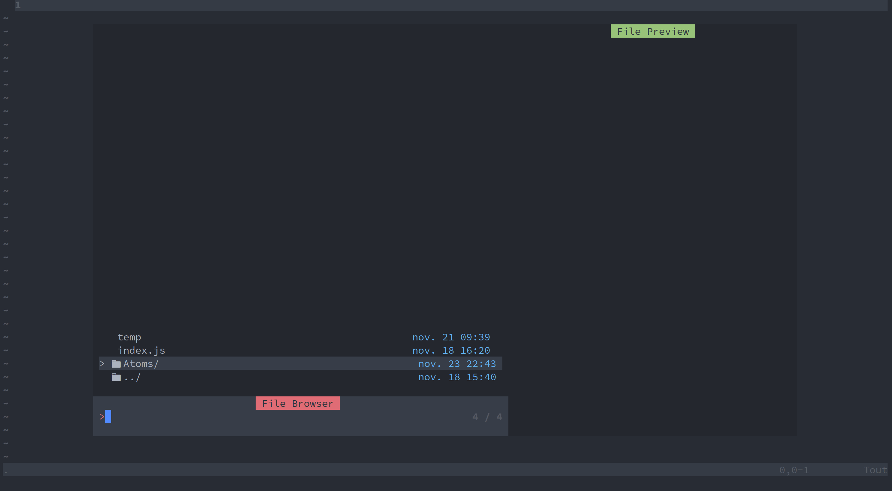

# NVTemplate

NVTemplate let you create files and automatically fill them with some custom templates.

## Features

- Fill files with default boilerplate
- Create custom files according to the template



## Variables

Here are some variables to use in configuration

| VARIABLE | Description                                                             |
| -------- | ----------------------------------------------------------------------- |
| FILENAME | The name of the initial file created (detected by the pattern wildcard) |

## Configuration

To configure your templates and files you have to edit the configuration

Example Structure

```lua
local status, nvtemplate = pcall(require, "nvtemplate")
if not status then
    return
end

nvtemplate.setup({
    templates = {
        tsx = {
            "import Styles from './${FILENAME}.module.scss';",
            "import clsx from 'clsx';",
            "",
            "type ${FILENAME}Props = {",
            "};",
            "",
            "export function ${FILENAME}({}: ${FILENAME}Props) {",
            "    return <div className={clsx(Styles.${FILENAME})}>",
            "    </div>",
            "};"
        },
        stories = {
            "import { ${FILENAME} } from './${FILENAME}';",
            "import { ComponentMeta, ComponentStory } from '@storybook/react';",
            "",
            "export default {",
            "    title: '${FILENAME}',",
            "    component: '${FILENAME}',",
            "    argTypes: {}",
            "} as ComponentMeta<typeof ${FILENAME}>;",
            "",
            "const Template: ComponentStory<typeof ${FILENAME}> = (args) => <${FILENAME} {...args} />;",
            "",
            "export const Default = Template.bind({});",
            "",
            "Default.args = {",
            "};"
        },
        scss = {
            ".${FILENAME} {",
            "}"
        },
        scsstypes = {
            "export const ${FILENAME}: string;"
        }
    },
    snippets = {
        {
            pattern = "**/Atoms/**/*.tsx",
            template = "tsx",
            childs = {
                {
                    name = "${FILENAME}.stories.tsx",
                    template = "stories"
                },
                {
                    name = "${FILENAME}.module.scss",
                    template = "scss"
                },
                {
                    name = "${FILENAME}.module.scss.d.ts",
                    template = "scsstypes"
                }
            }
        }
    }
})
```

### Credits

The idea came after seeing a PHPStorm feature...